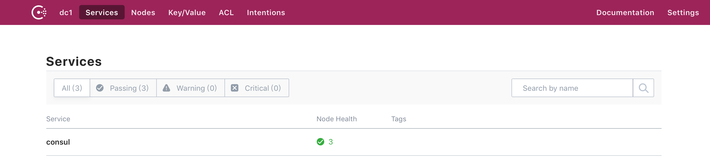
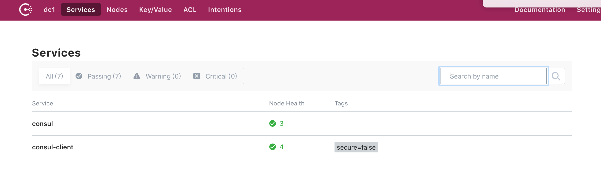
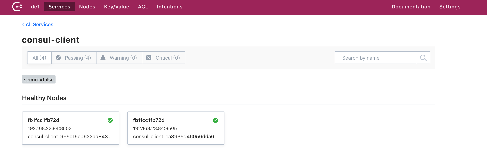

### SpringBoot 2.0.4&SpringCloud F版本(-) Consul 服务注册和发现

[TOC]

#### 0.为什么需要服务注册和发现

在传统应用中，应用部署都是部署在一台物理机器上，ip地址和端口是固定的。这些可能配置在配置文件中，调用时从配置文件中读取就好了。
但是在云平台中是不适用的，在微服务中服务实例会因为扩容、失败和升级等因素动态变化的，服务地址是不固定的。所以客户端需要更复杂服务发现机制。

##### 0.1 服务注册

服务注册表是服务发现的关键，它包含所有的服务实例。服务注册表要求是高可用和实时性。

服务注册一般包括:

> 服务注册 
>
> 心跳检查
>
> 服务发现
>
> 取消注册

可以作为服务注册的有:

Netflix Eureka: 通过运行多个 Eureka servers 达到高可用。

etcd：

consul：用于发现和配置服务的工具。可以执行状态检查确定服务可用性。

Zookeeper：一种广泛使用的高性能协调服务，适用于分布式应用程序。

##### 0.1.1 第三方注册和自注册

使用自注册模式时，服务实例负责向服务注册表注册和注销自身。 此外，如果需要，服务实例会发送心跳请求以防止其注册过期。 


Netflix OSS Eureka client 属于自注册模式，Eureka client 处理所有的服务注册和取消注册。

在Spring Cloud 工程中可以使用注解 `@EnableEurekaClient` 将服务实例自动注册到Eureka中。

第三方注册:

使用第三方注册模式时，服务实例不负责向服务注册表注册自己。 相反，另一个称为服务注册器的系统组件处理注册。 服务注册器通过轮询部署环境或订阅事件来跟踪对运行实例集的更改。 当它注意到新的服务实例时，它会将服务注册表注册到实例。 服务注册商还注销已终止的服务实例。


##### 0.1.2 高可用与一致性

大多数服务注册表都提供分区容错以及一致性或可用性。 由于CAP定理，它们不能提供所有三个。 例如，Eureka提供可用性，Consul和Apache Zookeeper 都提供了一致性。

##### 0.2 主要的服务发现模式:client-side discovery 和 server-side discovery

client-side discovery:
在客户端模式中，客户端负责确认所有的可用服务实例并负责负载均衡。服务启动时要把自己的服务信息(网络地址等)注册到服务注册表中，服务down机时要从服务注册表中移除。
通常使用心跳机制定期刷新服务实例的注册。

 Netflix Eureka  和  Netflix Ribbon 是这种模式，Eureka 提供服务注册和发现， Ribbon 提供负载均衡。
 这种模式比较简单，除了服务注册表之外,没有其他组件。另外客户端了解所有可用的服务实例，因此可用进行智能、特定的负载均衡策略。缺点是:客户端与服务注册表耦合在一起，不同的语言和框架必须实现自己的服务发现逻辑。


server-side discovery:

服务端模式是client发送一个请求到Load Balancer，然后LB查找服务注册表并把每个请求路由到服务实例。与客户端一样，也需要注册和注销服务注册表


AWS ELB 是这种模式，另外像Nginx plus和Nginx也可以用作服务端发现模式 负载均衡器。

一些部署环境像 [Kubernetes](https://github.com/kubernetes/kubernetes/blob/master/docs/design/architecture.md) and [Marathon](https://mesosphere.github.io/marathon/docs/service-discovery-load-balancing.html) 在每个集群上运行一个代理，这个代理就扮演了服务端服务发现模式负载均衡器的角色。

服务端发现模式的好处是，客户端没必要了解服务发现的细节，只要向负载均衡器发送请求就好了，另外不同语言和框架也不需要实现自己的客户端。缺点是，除非部署环境提供负载均衡器，否则需要自己实现和管理另外一个高可用组件。

更多细节可参考文章:
https://www.nginx.com/blog/service-discovery-in-a-microservices-architecture/


我们这里使用Consul来进行服务注册和发现

#### 1.Consul 介绍
https://www.consul.io/

Consul is a distributed service mesh to connect, secure, and configure services across any runtime platform and public or private cloud

Consul是一个分布式服务网格，用于跨任何运行时平台和公共云或私有云连接，保护和配置服务


##### 1.1 install & command
https://www.consul.io/intro/getting-started/install.html

##### 1.2 web 
安全启动后默认访问地址: http://localhost:8500/


##### 1.3 Docker compose 

docker dev 模式启动:

$ docker run -d --name=dev-consul -p 8500:8500 -e CONSUL_BIND_INTERFACE=eth0 consul


https://hub.docker.com/r/library/consul/  docker运行consul

https://github.com/emdem/consul-cluster-compose 单机consul-cluster docker compose 脚本，使用了7个实例

https://github.com/hashicorp/consul/blob/master/demo/docker-compose-cluster/docker-compose.yml 官方提供集群DEMO


###### 1.3.1 构建启动

我们使用官方集群demo启动

将 docker-compose.yml 

docker-compose up  创建容器并启动
docker-compose stop 

-d  后台运行

--no-recreate 不重新创建只启动未启动的容器

```
$ docker-compose up -d  --no-recreate
Starting consul_consul-server-2_1         ... done
Starting consul_consul-server-bootstrap_1 ... done
Starting consul_consul-agent-3_1          ... done
Starting consul_consul-agent-1_1          ... done
Starting consul_consul-agent-2_1          ... done
Starting consul_consul-server-1_1         ... done

```



可以看到consul 有3个节点。

https://www.jianshu.com/p/f8746b81d65d 一个consul使用的详细介绍

http://www.ymq.io/2017/11/26/spring-cloud-consul/  (推荐)更详细的可以参考这个


#### 2.SpringCloud 结合 consul使用

创建consul-client工程,这里推荐使用 https://start.spring.io 创建工程，因为SB1.x 和 SB2.x 在依赖方面改动还是比较大的，如果通过网上博客那样添加出出现各种各样的问题 o(╥﹏╥)o，IDEA工具自带。


在Cloud Discovery中选择 Consul Discovery,同时选择 监控 actuator，用来做健康检查，后边SpringBoot Admin 做监控也会用到。

pom.xml 

```
<dependency>
    <groupId>org.springframework.boot</groupId>
    <artifactId>spring-boot-starter-actuator</artifactId>
</dependency>

<dependency>
    <groupId>org.springframework.cloud</groupId>
    <artifactId>spring-cloud-starter-consul-discovery</artifactId>
</dependency>

```
application.java 中添加 @EnableDiscoveryClient注解

application.yml 文件

```yml
server:
  port: 8503
spring:
  cloud:
    consul:
      discovery:
        health-check-path: /actuator/health   # 健康健康路径，也可以自己写
        health-check-interval: 10s            # 检测轮训时间 1m 代码1分钟
        #instance-id: consul-client00 实例ID，唯一值
        instance-id: ${spring.application.name}:${vcap.application.instance_id:${spring.application.instance_id:${random.value}}}

      host: localhost
      port: 8500

  application:
    name: consul-client
```

启动服务实例:

在 consul-client 根目录下执行 mvn clean package ,我们这里启动两个client 实例 
```bash
$ nohup  java -jar target/consul-client-0.0.1-SNAPSHOT.jar  > /dev/null 2>&1 & 
$ nohup  java -jar target/consul-client-0.0.1-SNAPSHOT.jar --server.port=8503  > /dev/null 2>&1 & 

```
查看 consul UI 控制台 





